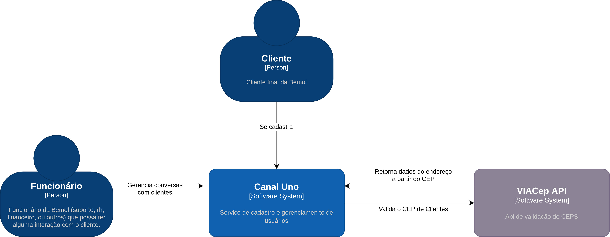
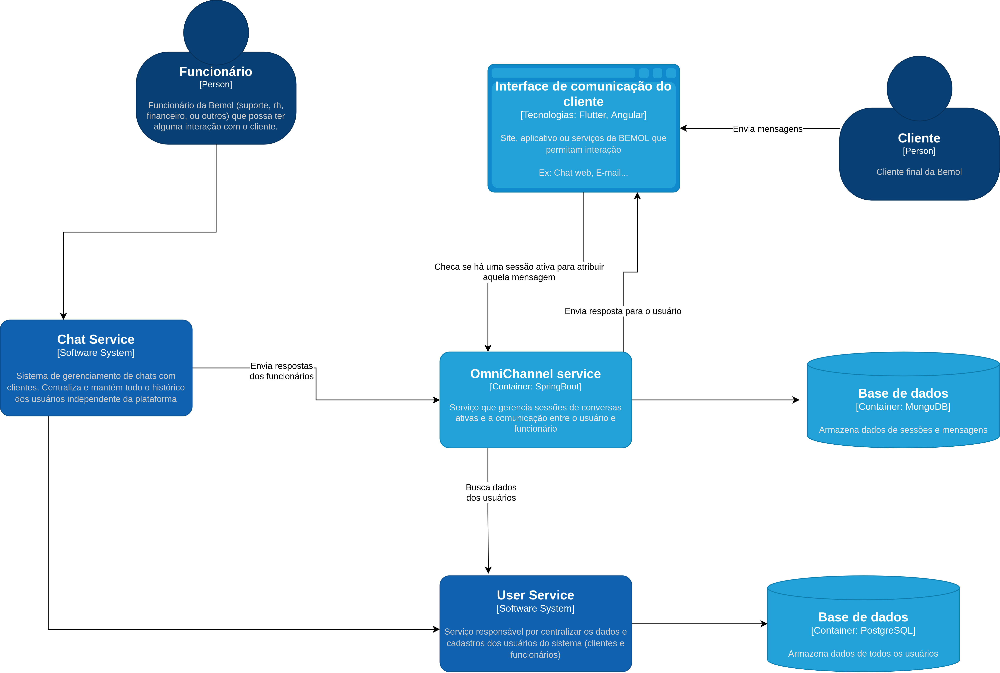

## Documentação de referência

### 📌 Clean Architecture

Este projeto (back-end) foi desenvolvido seguindo os princípios da **Clean Architecture**, garantindo uma estrutura modular, desacoplada e de fácil manutenção.

### 💡 Por que Clean Architecture?
Optei por essa abordagem para assegurar:
- ✅ **Escalabilidade** – A separação de responsabilidades facilita a adição de novas funcionalidades sem impactar outras partes do sistema.
- ✅ **Testabilidade** – A estrutura modular permite a escrita de testes unitários mais eficazes.
- ✅ **Manutenção simplificada** – O código bem organizado reduz o impacto de mudanças e facilita a refatoração.
- ✅ **Independência de tecnologias** – A lógica de negócio não depende diretamente de frameworks, bancos de dados ou interfaces, tornando o sistema mais flexível.

### 🏗️ Camadas da Arquitetura
- **Domínio** – Contém regras de negócio puras e independentes.
- **Aplicação** – Gerencia casos de uso e fluxos da aplicação.
- **Infraestrutura** – Implementa serviços externos como banco de dados e APIs.

Essa estrutura garante um código mais robusto e preparado para crescer junto com o projeto. 🚀


### 🔧 Como executar o projeto

Antes de iniciar, certifique-se de ter os seguintes requisitos instalados:

- [Docker](https://www.docker.com/get-started)
- [Docker Compose](https://docs.docker.com/compose/install/)


### Estrutura do Projeto

```
.
├── api                 # Backend (Java Spring Boot)
│   ├── dockerfile
│   ├── pom.xml
│   ├── src
│   └── target
├── docker-compose.yml  # Arquivo de configuração para execução via Docker Compose
├── web                 # Frontend (Flutter Web)
│   ├── dockerfile
│   ├── lib
│   ├── pubspec.yaml
│   └── web
```

### Executando o Projeto

Para iniciar a aplicação, execute o seguinte comando na raiz do projeto:

```sh
docker-compose up --build
```

Esse comando irá:
- Criar e iniciar os containers da API e do frontend web.
- Construir as imagens caso seja a primeira execução ou haja alterações.


### Acessando a aplicação

Após a execução do comando, a aplicação estará disponível nos seguintes endereços:

- **API**: [http://localhost:8080](http://localhost:8080)
- **SWAGGER**: [http://localhost:8080/swagger-ui/index.html](http://localhost:8080/swagger-ui/index.html)
- **WEB APP**: [http://localhost:8081](http://localhost:8081)


### Questões:

```
- A solução deve ser disponibilizada em Cloud ou On-premise?
   ```
  Optaria pela solução em Cloud. Essa escolha permite a escalabilidade de forma mais flexível, alémm de oferecer a alta disponibilidade que um serviço Omnichannel necessita. Essa abordagem também favorece a manutenção e que a infraestrutura se adapte conforme a necessidade.
```
- Considerando a participação de 4 pessoas técnicas para o desenvolvimento dessa solução, qual ferramenta acredita ser apropriada para o controle de tarefas da equipe? A ferramenta é ágil? -
Você se sente capaz de liderar esta equipe? Por quê?
   ```
  Acredito que o Jira seja a ferramenta ideal para essa atividade, considerando que é uma ferramenta amplamente utilizada em ambientes ágeis devido a facilidade de gerenciamment de sprints, backlogs e acompanhamento de tarefas, além de favorecer a colaboração e transparência da equipe, ideal para a metodologia ágil.


```
Considerando a participação de 4 pessoas técnicas para o desenvolvimento dessa solução, qual
ferramenta acredita ser apropriada para o controle de tarefas da equipe? A ferramenta é ágil? -
Você se sente capaz de liderar esta equipe? Por quê?
  ```
  Me faltam experiências práticas como líder, mas acredito que tenho as habilidades necessárias para coordenar uma equipe de quatro pessoas em um projeto. Ao longo da minha experiência, trabalhei tanto de forma independente quanto em equipe, sempre buscando soluções eficientes e organizadas. Já lidei com desafios complexos, onde precisei dividir tarefas, priorizar entregas e garantir a qualidade do produto final.
```
- Se pudesse sugerir uma melhoria, mudança ou oportunidade, o que
seria? - Acha válido esse desafio para o processo que está participando?
```
  Sugeriria investir tempo para criação de testes automatizados.

  Considero o desafio bastante válido para o processo seletivo. Ele permite avaliar não só competências técnicas na implementação de uma feature real, mas também a visão arquitetural, a capacidade de trabalhar com APIs externas, e a aptidão para pensar em escalabilidade e experiência omnichannel


## C4 Model

### Contexto


### Containers


